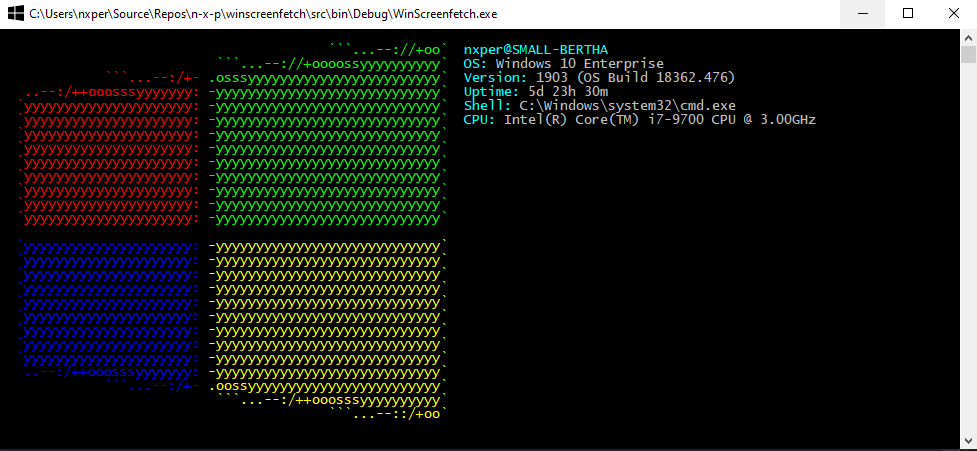

WinScreenfetch
=============
[screenfetch](https://github.com/KittyKatt/screenFetch) for Windows

Tired of seeing those cool ascii Linux distro's logos? now you can have it in your favorite OS.

WinScreenfetch is exactly that, screenfetch for Windows.

The ASCII art was created thanks to this site: http://www.text-image.com/convert/ascii.html

This is a fork of [Sebastian Gomez's winscreenfetch](https://github.com/sebagomez/winscreenfetch).1

[1] This branch has only been tested on windows 10
